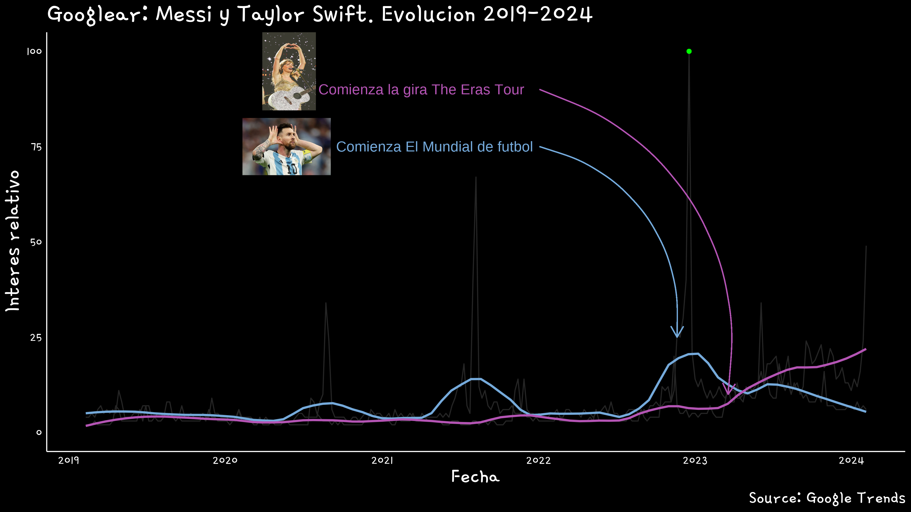

```{r}
     #.......................Configuración .Rmd.......................
knitr::opts_chunk$set(warning = FALSE, message = FALSE, echo = TRUE)
```

¿Sabías que [Taylor Swift](https://www.taylorswift.com/) viene hace 

```{r message=FALSE, warning=FALSE}
#install.packages('gtrendsR')
library(gtrendsR)
library(tidyverse)
library(gt)
library(glue)
library(magick)
library(patchwork)
library(png)
library(grid)
```


## Analizando la tendencia de #software en Argentina

Mediante el siguiente código vamos a jugar con el paquete `{gtrendsR}` y ver cómo de forma muy sencilla podemos trabajar con tendencias de Google directamente desde R.


## Caso de uso

Supongamos que necesitamos (si, ne-ce-si-ta-mos) conocer en qué lugar se encuentra R entre las búsquedas de google y, sobre todo (sí, so-bre-to-do) compararlo con sus compañeros de cuarto: PYTHON, SPSS y STATA.

## Manos en la masa

Lo primero que vamos a hacer es crear un obejto `tendencias` mediante la función `gtrends()` almacenaremos el resultado de una consulta a la API de Google en base a un término particular que definamos. La función es muy sencilla, con sólo especificar en el parámetro `keyword = ` qué palabras queremos extraer la función hará el trabajo sucio de devolvernos, entre todas las búsquedas, aquellas relativas a esa palabra. Pero hay que decir que para ciertos términos esta tarea puede no ser tan simple (aunque se resuelve bastante fácil). 

En el caso de programas como R, el término que definimos es una letra, por lo que Google puede traernos resultados de búsquedas que no tengan que ver con R como programa para procesamiento de información estadística. Para ello vamos a recurrir a los **COMO DIABLOS SE LLAMA**.

La idea es que, siempre que se busque a R como programa estadístico, Google le asigna un _id_ específico que permite discernir entre búsquedas. Lo mismo para el resto de las palabras, por lo que, una vez aclarado esto, la sentencia final quedaría así:

```{r}
tendencias <- gtrends(
  keyword = c("Messi", "Taylor Swift"),
  gprop = "web",
  #geo = "AR",
  time = "today+5-y")
```

```{r}
### Me quedo con la comparación entre regiones
#tend_region <- tendencias$interest_by_region

tend_tiempo <- tendencias$interest_over_time |> 
  mutate(hits = case_when(hits == "<1" ~ ifelse(is.character(hits), "0", 0),
                          .default = hits),
         hits = as.numeric(hits))

hits_min <- min(tend_tiempo$hits)
hits_max <- max(tend_tiempo$hits)
date_max <- tend_tiempo |> filter(hits == hits_max) |> pull(date)
quien_max <- tend_tiempo |> filter(hits == hits_max) |> pull(keyword)
date_min <- tend_tiempo |> filter(hits == hits_min) |> pull(date) |> max()

sysfonts::font_add_google(name = "Gamja Flower")
showtext::showtext_auto()
#fuetes <- sysfonts::font_info_google()

p <- 
  tend_tiempo %>% 
  ggplot(aes(x = date, y = hits, group = keyword, col = keyword)) +
  geom_line(color = "#252525") +
  geom_smooth(span=0.2, se=FALSE) +
  scale_color_manual(values = c("#75aadb", "#b454b4")) +
  geom_point(x = date_max, y = hits_max, color = "green") +
  geom_hline(yintercept = 0) + 
  scale_x_datetime(breaks = "1 year", date_labels = "%Y") +
  annotate(geom = "text", x = date_max, y = hits_max, 
           label = glue("{month(date_max, label = TRUE)} - {year(date_max)}: {quien_max}"),
           hjust = 1.1) +
  ### Taylor
  geom_curve(x = 1641184000, 
             y = 90, 
             xend = 1679184000, 
             yend = 10,
             curvature = -0.4, color = "#b454b4",
             arrow = arrow(length = unit(0.03, "npc"))) +
  annotate(geom = "text", 
           x = date_max, 
           y = 90, color = "#b454b4",
           size = 15,
           label = "Comienza la gira The Eras Tour",
           hjust = 1.8) +
  ### Messi
  geom_curve(x = 1641184000, 
             y = 75, 
             xend = 1668902400, 
             yend = 25,
             curvature = -0.4, color = "#75aadb",
             arrow = arrow(length = unit(0.03, "npc"))) +
  annotate(geom = "text", 
           x = date_max, 
           y = 75, 
           size = 15,
           color = "#75aadb",
           label = "Comienza El Mundial de futbol",
           hjust = 1.8) +
  labs(title = glue("Googlear: Messi y Taylor Swift. Evolucion {year(today())-5}-{year(today())}"), 
       x = "Fecha", y = "Interes relativo", caption = "Source: Google Trends") +
  theme_minimal() +
  theme(
    text = element_text(color = "white", size = 50, family = "Gamja Flower"),
    title = element_text(size = 70),
    panel.grid.major = element_blank(),
    panel.grid.minor = element_blank(),
    axis.line = element_line(color = "white"),
    axis.text = element_text(color = "white"),
    legend.position = "none"
  )
#p


### Agrego logo de mate
messi <- readPNG(here::here("content/draft/2021-12-01-r-tendencias-de-google/img/messi.png"), native = TRUE)
taylor <- readPNG(here::here("content/draft/2021-12-01-r-tendencias-de-google/img/taylor.png"), native = TRUE)

g_messi <- rasterGrob(messi, 
                width = .2, 
                height = .3)
g_taylor <- rasterGrob(taylor, 
                       width = .2, 
                       height = .3)

# camcorder::gg_record(
#   dir = "img",
#   width = 12,
#   height = 12 * 9 / 16,
#   dpi = 300,
#   bg = "black"
# )

p <- p +
  annotation_custom(g_messi, xmin = 1545728000, xmax = 1634728000, ymin = 50, ymax = 100) +
  annotation_custom(g_taylor, xmin = 1563728000, xmax = 1617728000, ymin = 60, ymax = 130)
```




