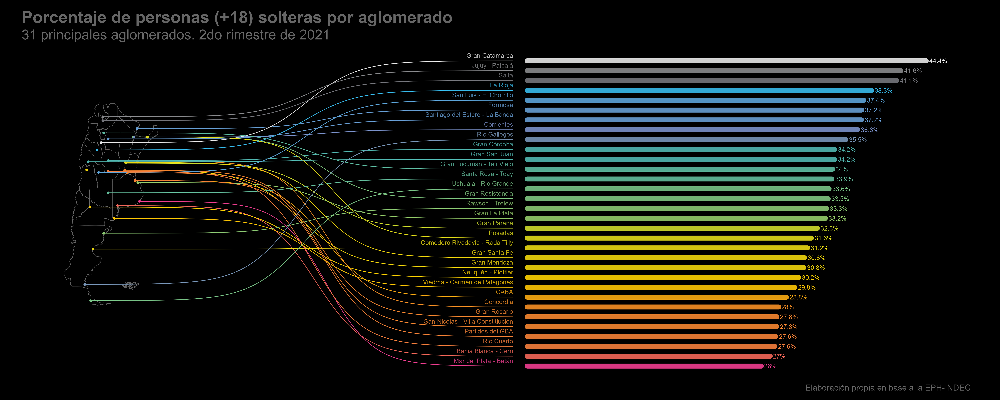

```{r}
     #.......................Configuración .Rmd.......................
knitr::opts_chunk$set(warning = FALSE, message = FALSE, echo = TRUE)
```

## Introducción

Este post nace como ejercicio para probar los mapas de XXX del autor XXX. El "caso de uso" será conocer la participación de personas solteras sobre el conjunto de la población mayor de 18 años en los 31 principales aglomerados relevados por la Encuesta Permanente de Hogares (EPH-INDEC)[^1]

[^1]: AGREGAR link a la encuesta

Una de las razones para elegir este caso de uso, además de la curiosidad, es el "match" que hay entre el tipo de visualización y el dato disponible. La fuente de datos (EPH) es una encuesta a hogares, de medición continua y tiene entre sus principales objetivos relevar información sobre el mercado de trabajo argentino y, al mismo tiempo, brindar datos sobre las principales características socio demográficas de la población entre censo y censo[^2]

[^2]: Recordar que los censos se realizan en Argentina y en la mayoría de los países, cada 10 años.

A pesar de esta enorme potencialidad, lo que la convierte entre los operativos más importantes realizados por el Sistema Estadístico Nacional Argentino, la encuesta presenta una limitación a considerar, que es la extensión, la representatividad de sus datos con alcance limitado a los 31 principales aglomerados urbanos[^3], y no sobre el total de la población. Esto hace que a la hora de querer analizar y detectar patrones espaciales, el dar información por aglomerado impide "pintar" regiones mayores al centroide específico de la mancha urbana en cuestión.

[^3] Todas las capitales de las provincias y aquellos aglomerados de 100.000 o más habitantes.

Dicho esto... luz, cámara y ¡acción!

```{r}
##~~~~~~~~~~~~~~~~~~~~~~~~~~~~~~~~~~~~~~~~~~~~~~~~~~~~~~~~~~~~~~~~~~~~~~~~~~~~~~
##                              Cargo librerías                             ----
##~~~~~~~~~~~~~~~~~~~~~~~~~~~~~~~~~~~~~~~~~~~~~~~~~~~~~~~~~~~~~~~~~~~~~~~~~~~~~~
library(ARTofR)
library(eph)
library(tidyverse)
library(sf)
library(geoAr)
library(datawizard)
library(ggbump)
library(herramientas)
```

### Datos

Comencemos por descargar los datos que nos permitan desarrollar los indicadores en cuestión. Para obtener los de la Encuesta Permanente de Hogares podemos disfrutar de las bondades del paquete `{eph}`[^4] y su función `get_microdata()`:

[^4]: AGREGAR cita al paquete y link

```{r}
eph_ind <- get_microdata(year = 2021, trimester = 2, type = "individual")

head(eph_ind, 5)
```

Con la base podemos pensar la tabla con el indicador que nos muestre el porcentaje de personas solteras:

```{r}
### 
tabulado <- eph_ind %>%
  filter(CH06 >= 18) %>% 
  count(AGLOMERADO, CH07, wt = PONDERA) %>% 
  group_by(AGLOMERADO) %>% 
  mutate(porc = round(n / sum(n) * 100,2),
         AGLOMERADO = as.factor(AGLOMERADO)) %>% ungroup() %>% 
  filter(CH07 == 5) %>% 
  select(AGLOMERADO, porc)
```

## El mapa.

Para poder referenciar el indicador al punto geográfico donde se ubica el aglomerado a quien corresponde vamos a necesitar dos cosas:

- Una capa de puntos con la ubicación (latitud y longitud) los aglomerados. Para esto nos hacemos uso de la cartografía que pone a disposición el INDEC[^5]

[^5]: AGREGAR link a página del INDEC con la cartografía para la EPH.

```{r}
### Capa de aglomerados
aglos <- sf::st_read('capas/aglomerados_eph.json')

centroides_aglomerados <-  aglos %>%
  filter(!st_is_empty(geometry)) %>%
  group_by(eph_codagl) %>%
  summarise(AGLOMERADO = as.integer(paste(unique(eph_codagl))),
            nombre_aglomerado = unique(eph_aglome)[1]) %>%
  st_centroid() %>% 
  st_transform('+proj=longlat +datum=WGS84')

centroides_aglomerados <- centroides_aglomerados %>% 
  bind_cols(
    sf::st_coordinates(centroides_aglomerados) %>%
      as_tibble() %>%
      rename(lon=X, lat=Y)) %>%
  as_tibble()
```

- Una capa de polígonos, con la delimitación administrativa de las provincias, para darle un marco espacial a los puntos (pensemos que los aglomerados no son el punto medio de cada provincia pero sí dicen mucho de ella). Para esto vamos a usar el paquete `{geoAr}`[^6] con su función `get_geo()` que permite disponver de mapas de Argentina de forma muy sencilla con diferentes tipos de subdivisión. 

[^6] AGREGAR cita al paquete

```{r}
### Capa de provincias argentinas.
mapa_arg <- get_geo("ARGENTINA", level = "provincia")
```


## Dayos y mapas

Una vez que tenemos el dato y, a su vez, preparado el escenario donde montarlos, vamos por la síntesis de ambos:

```{r}
tabla_graf <- centroides_aglomerados %>% 
  mutate(AGLOMERADO = as.factor(AGLOMERADO)) %>%
  left_join(tabulado) %>% 
  mutate(
    col_y = rank(-porc) %>% 
      data_rescale(to=c(-15, -65)),
    sigmoid_end = 22,
    col_x_start = 25,
    col_x_end = porc %>%  
      data_rescale(to=c(25, 110), range = c(0, max(porc))),
    area_label = paste0(round(porc, 1), "%")
  )
```

## La visualización

```{r}
grafico <- ggplot(tabla_graf) +
  geom_sf(data=mapa_arg, size = .3, fill = "transparent", color = "gray40") +
  geom_point(aes(x=lon, y=lat, color=porc)) +
  geom_sigmoid(
    aes(x=lon, y=lat, xend=sigmoid_end, yend=col_y, group=nombre_aglomerado, color=porc)
  ) +
  geom_text(
    aes(label=nombre_aglomerado, x=sigmoid_end, y=col_y, color=porc), 
    hjust=1, size=4, vjust=0, nudge_y = 0.5, alpha=0.8,
  ) +
  geom_segment(
    aes(x=col_x_start, xend=col_x_end, y=col_y, yend=col_y, color=porc), 
    size = 4.2, alpha = .9, size = 1, 
    lineend = "round"
  ) +
  geom_text(
    aes(label=area_label, x=col_x_end, y=col_y, color=porc), 
    hjust=-0.1, size=4, nudge_x = .3
  ) +
  labs(
    title="Porcentaje de personas (+18) solteras por aglomerado",
    subtitle = "31 principales aglomerados. 2do rimestre de 2021",
    caption = "Elaboración propia en base a la EPH-INDEC"
  ) +
  coord_sf(clip = "off") +
  comunicacion::scale_fill_dnmye(discrete = F) +
  comunicacion::scale_color_dnmye(discrete = F) +
  theme_void() +
  theme(plot.margin = margin(.5, 1, .5, .5, "cm"),
        legend.position = "none",
        plot.background = element_rect(fill = "black"),
        plot.caption = element_text(color = "gray40", size = 15),
        plot.title = element_text(color = "gray40", size = 30, family = "Helvetica", face = "bold"),
        plot.subtitle = element_text(color = "gray40", size = 25))

print(grafico)

ggsave("ranking_porcs.png",width = 25, height = 10, dpi = 300)

```


```{r out.height='120%'}

```

```{r fig.width=25, fig.height=45,echo=FALSE}
library(png)
library(grid)
img <- readPNG("ranking_porcs.png")
 grid.raster(img)
```


