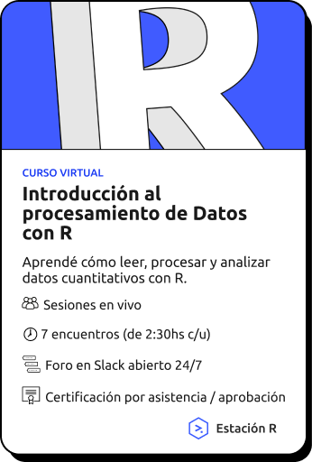
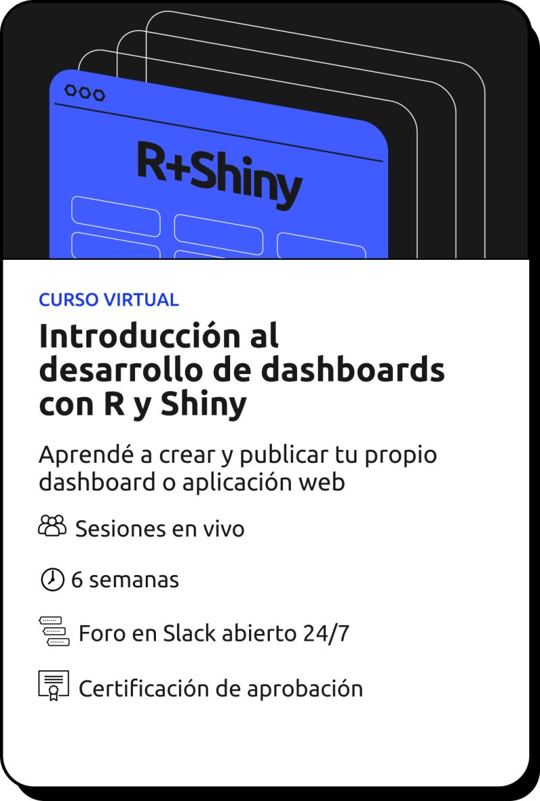
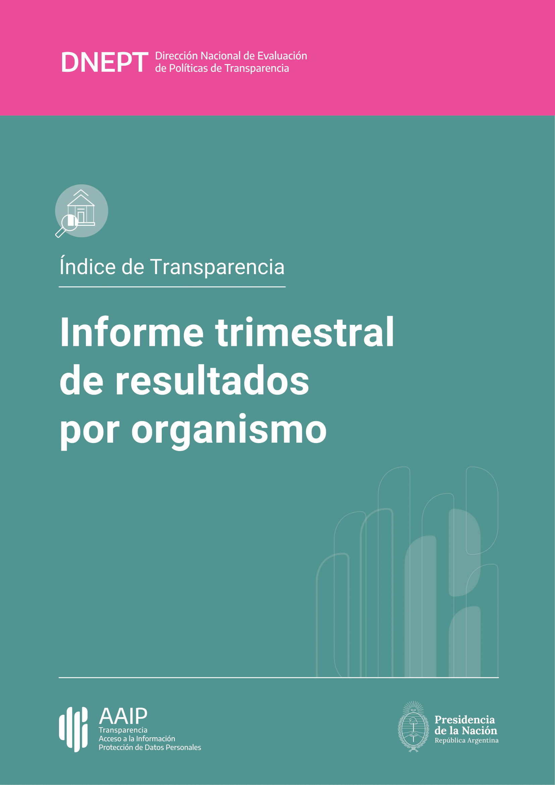

```{r echo=FALSE, fig.align='center', out.width = "700px"}
knitr::include_graphics("img/Logo_PNG_Alta_Mesa de trabajo 1.png")
```

## Resumen 2024: Un año de crecimiento y aprendizajes en Estación R

Este 2024 ha sido un año emocionante para Estación R. Hemos alcanzado hitos importantes, sumado aprendizajes y contribuido a la comunidad de datos + R con nuevas iniciativas. A medida que cerramos este capítulo, miramos hacia el 2025 con más energía que nunca.

## Lo que logramos en 2024


### **Cursos y formación**


:::::: {.columns}
::: {.column width="48%" data-latex="{0.48\textwidth}"}

**Dos cohortes del curso "Introducción al Procesamiento de Datos con R".** 

Este curso se consolidó como una de nuestras propuestas más populares, ayudando a decenas de personas a dar sus primeros pasos en el análisis de datos con R.

:::

::: {.column width="4%" data-latex="{0.04\textwidth}"}
\ <!-- an empty Div (with a white space), serving as a column separator -->
:::

::: {.column width="48%" data-latex="{0.48\textwidth}"}


{width=50%}
:::
::::::
\ <!-- an empty Div again to give some extra space before the next block -->


:::::: {.columns}
::: {.column width="48%" data-latex="{0.48\textwidth}"}

{width=50%}

:::

::: {.column width="4%" data-latex="{0.04\textwidth}"}
\ <!-- an empty Div (with a white space), serving as a column separator -->
:::

::: {.column width="48%" data-latex="{0.48\textwidth}"}

**Nuevo curso: "Introducción al desarrollo de Dashboards y Aplicaciones web con R y Shiny".** 

De la mano de [Elian Soutullo](https://www.linkedin.com/in/eli%C3%A1n-soutullo/), este curso fue un éxito en su primera versión ya estamos trabajando en una nueva edición para el 2025, además de planear talleres específicos para profundizar en estas herramientas.

:::
::::::
\ <!-- an empty Div again to give some extra space before the next block -->


### **Contribuciones a la comunidad**

- **Nuestro blog**: Finalmente logramos publicar algunos artículos, compartiendo experiencias, tips y reflexiones para seguir aportando al ecosistema de R.

- **Tips de R**: ¡Publicamos más de **200 tips de R** en nuestras redes (X, LinkedIn, Mastodon y Bluesky)!. Este proyecto sigue creciendo gracias al entusiasmo y apoyo de la comunidad.


### **Colaboración con organizaciones**

:::::: {.columns}
::: {.column width="48%" data-latex="{0.48\textwidth}"}

**Flujo de trabajo con datos y automatización de reportes.** 

Trabajamos junto a la Agencia de Acceso a la Información Pública (AAIP) para desarrollar un flujo de trabajo que automatiza la importación, limpieza y publicación de datos. Este sistema no solo optimiza el proceso para publicar datos en el portal de datos abiertos del organismo, sino que también genera **más de 200 reportes automáticos** con solo unos clics.

:::

::: {.column width="4%" data-latex="{0.04\textwidth}"}
\ <!-- an empty Div (with a white space), serving as a column separator -->
:::

::: {.column width="48%" data-latex="{0.48\textwidth}"}


{width=60%}
:::
::::::
\ <!-- an empty Div again to give some extra space before the next block -->


**Capacitación de equipos de datos.**

Diseñamos y llevamos adelante una capacitación al equipo de datos de la AAIP, dándoles asistencia y herramientas para que puedan mantener y mejorar el flujo de trabajo con sus propias manos.

```{r echo=FALSE, fig.align='center'}
knitr::include_graphics("img/circuito_del_dato_tidy.png")
```

## ¡Lo que se viene en 2025!

### **Proyectos con organizaciones**

Seguiremos apoyando a las organizaciones en el diseño de flujos de trabajo con datos y tableros que faciliten el procesamiento de datos, el análisis de la información y la toma de decisiones. Siempre tratamos de acompañar este trabajo con un plan de capacitación integral para que las organizaciones se conviertan en dueñas de sus propios procesos.


### **Más Estaciones R**

Ya estamos diseñando y planificando nuevos cursos para acompañar tu crecimiento en el mundo de la Ciencia de Datos con R.

✅ Una nueva edición del curso **"Introducción al Procesamiento de Datos con R"**, ahora también con su versión asincrónica para que la hagas a tu ritmo.

✅ Una nueva edición del curso **"Introducción al desarrollo de Dashboards y Aplicaciones web con R y Shiny"**.

✅ Nuevos cursos como:

  - **R Intermedio**
  - **Git y GitHub**
  - **Armado de reportes con R**


### **Una nueva plataforma para Estación R**

Estamos trabajando en el desarrollo de una nueva página web. Desde allí, podrás:

- Gestionar tus cursos sincrónicos y asincrónicos.
- Acceder a las novedades.
- Leer artículos exclusivos que continuaremos publicando.


## ¡Gracias por acompañarnos!

Nada de esto sería posible sin el apoyo de la comunidad que cree en nuestro trabajo y en la importancia de fomentar una cultura de datos abierta y accesible. Estamos entusiasmados por todo lo que viene en el 2025 y esperamos seguir creciendo juntos.

¡Sigamos explorando y aprendiendo con R!

